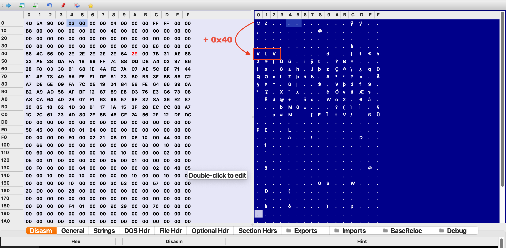

# VAC-Module-Dumper

## Introduction

Valve Anti-Cheat (VAC) is Valve’s proprietary security system designed to detect and mitigate cheating in its multiplayer titles, most prominently within the Counter-Strike franchise. At the core of its operation is **steamservice.dll**, a dynamic link library responsible for handling the initialization and execution of VAC’s routines.

How this library is loaded depends on the privilege level at which Steam is launched:  
- When Steam runs without administrative rights, **steamservice.dll** is executed by **SteamService.exe**.  
- When Steam is launched with elevated privileges, the DLL is instead loaded directly by **steam.exe**.

This difference is not trivial but a fundamental architectural choice. It is crucial for dumping modules in the way I will explain, because you need to pick the second option—running Steam as administrator, so that **steam.exe** directly loads **steamservice.dll**.

---

## Why is it important how Steam loads its modules?

Anyone interested in bypassing even a basic anti-cheat system knows that the first step is to reverse engineer its logic and understand the checks it performs. To bypass an anti-cheat, you first need to reverse it. But… what happens if those modules never touch disk and are streamed directly from the server?

In that case, reverse engineering the anti-cheat modules is not straightforward. The approach then is to locate where those modules are loaded in memory and understand exactly how the program maps them. I will show you the logic Valve applies to stream and map these modules, and how we can take advantage of the control flow to dump them in the easiest possible way.

We will also look at some of the routines the loader uses for integrity checks, as well as the internal structures Valve defines to handle those modules.

## How VAC Modules Work

Unlike static anti-cheat implementations, VAC does not embed all detection logic within the game binary. Instead, **VAC modules are streamed dynamically from Valve’s servers**, allowing Valve to deliver targeted updates and continuously adapt its detection capabilities.

Each streamed module encapsulates detection algorithms, integrity verification routines, and system interrogation logic. The VAC client dynamically integrates these modules during runtime.

The system can be summarized as follows:  
- **Server-side (Valve infrastructure):** Decides which modules to stream to a client based on contextual factors such as game, environment, or suspicious patterns.  
- **Client-side (VAC core):** Receives, validates, maps, and executes the streamed modules in a controlled environment.  
- **Security model:** Dynamic streaming prevents reverse engineers from relying on static binaries, enabling Valve to iterate rapidly on detection methods while reducing the attack surface.

---

## The Routine Responsible for Loading

The orchestration of VAC’s streamed modules is handled within **steamservice.dll**. A key observation is that every module delivered from Valve’s servers shares a common feature: each exports a function named **"_runfunc@20"**. This function serves as the standard entry point invoked by **steamservice.dll** to execute the module, typically within its own dedicated thread. The presence of this export can also be confirmed by inspecting the DLL’s strings, as shown in the screenshots.


Following this string reference leads us directly to the routine responsible for handling module loading.

---

## Module Loading Routine

The pseudocode below outlines the logic of the `sub_6F6E8FD0` function. The decompilation has been cleaned up and annotated to highlight inferred types and identified routines.

During reverse engineering, one of the first notable findings is that Valve uses a dedicated structure to store metadata for each streamed module. This structure is defined as follows:

```cpp
00000000 struct __fixed VLV_STRUCT // sizeof=0x20
00000000 {
00000004     uint32_t h_field;
00000008     char allocated_heap;
0000000C     char runfunc_address;
00000010     uint32_t state_code;
00000014     uint32_t buffer_size;
00000018     IMAGE_DOS_HEADER *dos_header;
00000020 };
```

The structure is passed as the first argument to the function and maintains all relevant module information throughout the loading routine. The second argument acts as a flag that determines the execution flow, as there are two major paths in the routine.

<p align="center">
  
</p>

These two flows correspond to the two primary methods Valve employs to load streamed modules. The first method is **manual mapping**: after mapping the module into memory, the loader retrieves the exported entry point "_runfunc@20" and stores it in the `VLV_STRUCT` instance.
```cpp
if ( (module_flags & 2) != 0 )              // Manual mapping module load
{
    heap_ptr = manual_map(ValveStruct_2->dos_header, 0, 1);
    *&ValveStruct_2->allocated_heap = heap_ptr;
    if ( heap_ptr )
    {
        exported_address = get_exported_address(heap_ptr, "_runfunc@20");
        *&ValveStruct_2->runfunc_address = exported_address;
        if ( !exported_address )
            ValveStruct_2->state_code = runfunc_function_not_found;
    }
    else
    {
        ValveStruct_2->state_code = module_not_allocated;
    }
}
```

The alternative control flow is the standard file-based module load using `LoadLibrary`. Notably, this path requires the module to exist on disk, which introduces a tangible point of access that we can exploit for interception and analysis.

```cpp
else                                        // File based module load
    {
      ValveStruct = 0;
      sub_6F7077B0(&v19);
      ValveStruct_2->state_code = 0;
      if ( create_temporal_file(&ValveStruct) )
      {
        sub_6F7091D0(&v19, ValveStruct_2->dos_header, ValveStruct_2->buffer_size, ValveStruct_2->buffer_size, 0);
        valve_struct = &pszSubKey;
        v10 = &pszSubKey;
        if ( ValveStruct )
          v10 = ValveStruct;
        if ( write_module_to_file(&v19, v10, 0) )
        {
          v11 = &pszSubKey;
          if ( ValveStruct )
            v11 = ValveStruct;
          sub_6F707310(&ValveStruct_2[1].allocated_heap, v11);
          if ( ValveStruct )
            valve_struct = ValveStruct;
          library = load_library(valve_struct, 0);
          ValveStruct_2->h_field = library;
          if ( library )
          {
            exported_address_disk = get_exported_address_disk(library, "_runfunc@20");
            *&ValveStruct_2->runfunc_address = exported_address_disk;
            if ( !exported_address_disk )
              ValveStruct_2->state_code = runfunc_function_not_found_disk;
          }
          else
          {
            ValveStruct_2->state_code = 22;
          }
        }
        else
        {
          ValveStruct_2->state_code = 21;
        }
        if ( v21 >= 0 )
        {

            . . .
          
        }
        v15 = sub_6F779360();
        (*(*v15 + 28))(v15, ValveStruct, 0);
      }
      else
      {

            . . .
          
      }
    } 
```
Knowing this, and considering that the second execution path drops the module into the user's temporary folder, we only need to trigger that path. Let’s examine the condition that controls this branch and observe how it appears in the disassembler and the debugger.

<p align="center">
  
</p>

<p align="center">
  
</p>

Knowing this, we coded a [C++ program](https://github.com/Aspasia1337/VAC-ModuleDumper/blob/main/src/cpp/ModDumper.cpp) that attaches to the target process, resolves the base address of `steamservice.dll`, and modifies the instruction at the conditional jump. The patch forces the branch to always be taken, effectively making the loader use the disk-based code path every time.

In the unmodified binary, the sequence looks like this:
```
test    [ebp+drop_mod_on_disk], 2
jz       short loc_6F6E90B7
```
We will replace it with this sequence of bytes:
```
nop
nop
test    eax, eax
```
This ensures the jump is always performed, guaranteeing that every streamed module is materialized on disk prior to being mapped into memory using the LoadLibrary flow and not the manual mapping one.

<p align="center">
  
</p>

To test the patch, start Steam with administrative privileges and then run the patching utility, also as administrator, so it can modify the target process. Once applied, the utility confirms the memory modification of the conditional branch. With the patch active, launch a VAC-protected game like Counter-Strike 2.

Using Process Monitor, you can observe the patched loader consistently writing the streamed module binaries to Steam's temporary directory. Within moments of joining a multiplayer game, these modules appear as actual files in the temp folder, ready for inspection and reverse engineering. The images below show the streamed modules and their persistence on disk after the patch.

<p align="center">
  
</p>

<p align="center">
  
</p>

---

## Module Integrity Checks

If you're still here, I suppose you want to know more than just how to simply dump the modules from the anti-cheat, right?

Well, I’ve got something interesting for you. Valve performs integrity checks on the modules before loading them. The routine is as follows, can you spot anything interesting?

```cpp
state_code __cdecl check_module_integrity(
        IMAGE_DOS_HEADER *module_dos_header_array,
        unsigned int buffer_size,
        int a3,
        unsigned int a4)
{
  unsigned int e_lfanew; // edx
  _WORD *v6; // eax
  int *v7; // edi
  int *v8; // ecx
  _DWORD *v9; // esi
  char *v10; // eax
  int v11; // edi
  int v12; // edi
  int v13; // edx
  char v14; // dl
  unsigned int v15; // esi
  size_t v16; // edi
  bool v17; // zf
  char *v18; // eax
  int v19; // [esp-Ch] [ebp-C4h]
  _BYTE v20[128]; // [esp+4h] [ebp-B4h] BYREF
  WORD *p_e_sp; // [esp+84h] [ebp-34h]
  _DWORD v22[4]; // [esp+88h] [ebp-30h] BYREF
  char *v23; // [esp+98h] [ebp-20h]
  _DWORD *v24; // [esp+9Ch] [ebp-1Ch]
  char *v25; // [esp+A0h] [ebp-18h]
  _DWORD *v26; // [esp+A4h] [ebp-14h]
  int v27; // [esp+A8h] [ebp-10h]
  int v28; // [esp+ACh] [ebp-Ch]
  int v29; // [esp+B0h] [ebp-8h]
  char *v30; // [esp+B4h] [ebp-4h]
  char *buffer_sizea; // [esp+C4h] [ebp+Ch]
  char buffer_size_3; // [esp+C7h] [ebp+Fh]

  if ( buffer_size < 0x200 )
    return error;
  if ( module_dos_header_array->e_magic != 'ZM' )// DOS_HEADER e_magic -> MZ
    return error;
  e_lfanew = module_dos_header_array->e_lfanew;
  if ( e_lfanew < 0x40 || e_lfanew >= buffer_size - 248 || *(&module_dos_header_array->e_magic + e_lfanew) != 'EP' )// PE_HEADER
    return error;
  if ( *&module_dos_header_array[1].e_magic != 'VLV' ) 
    return not_VLV_8;
  if ( *&module_dos_header_array[1].e_cp != 1 ) // Module should have 1 page = 512 bytes
    return more_than_1_page;
  if ( buffer_size < *&module_dos_header_array[1].e_cparhdr )// Buffer must be bigger than module header
    return small_buffer;
  v30 = 0;
  buffer_sizea = 0;
  v6 = (&module_dos_header_array->e_lfarlc + e_lfanew);
  if ( *v6 == 267 )                             // Integrity check
  {
    v30 = &module_dos_header_array->e_lfarlc + e_lfanew;
    goto LABEL_15;
  }
  if ( *v6 != 523 )
    return small_buffer;
  buffer_sizea = &module_dos_header_array->e_lfarlc + e_lfanew;
LABEL_15:
  p_e_sp = &module_dos_header_array[1].e_sp;
  qmemcpy(v20, &module_dos_header_array[1].e_sp, sizeof(v20));
  memset(&module_dos_header_array[1].e_sp, 0, 0x80u);
  v7 = (buffer_sizea + 64);
  v24 = buffer_sizea + 64;
  v8 = (buffer_sizea + 144);
  v23 = buffer_sizea + 144;
  v9 = v30 + 64;
  v26 = v30 + 64;
  v10 = v30 + 128;
  v25 = v30 + 128;
  if ( v30 )
  {
    v11 = *v9;
    *v9 = 0;
    v29 = v11;
    v28 = *v10;
    v12 = *(v10 + 1);
    *v10 = 0;
    v27 = v12;
    *(v10 + 1) = 0;
  }
  else
  {
    v13 = *v7;
    *v7 = 0;
    v29 = v13;
    v28 = *v8;
    v27 = *(buffer_sizea + 37);
    *v8 = 0;
    *(buffer_sizea + 37) = 0;
    v26 = v9;
    v25 = v10;
    v24 = buffer_sizea + 64;
    v23 = buffer_sizea + 144;
  }
  v14 = 0;
  v15 = 0;
  while ( v15 < a4 )
  {
    v16 = *&module_dos_header_array[1].e_cparhdr;
    v22[1] = 1;
    v22[2] = 0;
    v19 = *(a3 + 4 * v15);
    v22[3] = 0;
    v22[0] = &off_6F91E0DC;
    if ( sub_6F7132E0(v19) && sub_6F713050(v22) )
    {
      buffer_size_3 = sub_6F713860(module_dos_header_array, v16, v20, 128, v22);
      sub_6F712F50(v22);
      v14 = buffer_size_3;
      ++v15;
      if ( buffer_size_3 )
        break;
    }
    else
    {
      sub_6F712F50(v22);
      v14 = 0;
      ++v15;
    }
  }
  v17 = v30 == 0;
  qmemcpy(p_e_sp, v20, 0x80u);
  if ( v17 )
  {
    *v24 = v29;
    v18 = v23;
  }
  else
  {
    *v26 = v29;
    v18 = v25;
  }
  *v18 = v28;
  *(v18 + 1) = v27;
  return v14 == 0;
}
```

If you look closely, there are checks for common Portable Executable files, determining sections and headers. But did you notice this check?

```cpp
  if ( *&module_dos_header_array[1].e_magic != 'VLV' ) 
      return not_VLV_8;
```
This accesses the first byte immediately following the _IMAGE_DOS_HEADER, which is at offset 0x40 (64 bytes from the start of the header), to check for the VLV (VALVE) signature. If our assumption is correct, every module written to disk should contain this signature at offset 0x40 from the IMAGE_DOS_HEADER. We verified this using PE-bear to inspect the modules and... voila.


<p align="center">
  
</p>

## Closing Thoughts

Now that you know how to dump VAC modules, you can inspect them directly, understand what the anti-cheat actually checks, and explore ways to analyze or bypass certain routines. That said, **steamservice.dll** and, in particular, its **manual mapping mechanism**, are worth a closer look. While I won’t cover all the details in this post, observing how Steam maps a file with manual mapping and comparing it with its own approach can teach you a tremendous amount.  

I won’t be sharing the IDA database for my files, so you’re encouraged to reverse them yourself and explore the details firsthand. If you have any questions or want to discuss your findings, **don’t hesitate to reach out**, and we can review it together.  

For any reverse engineer, understanding these techniques is incredibly valuable. 